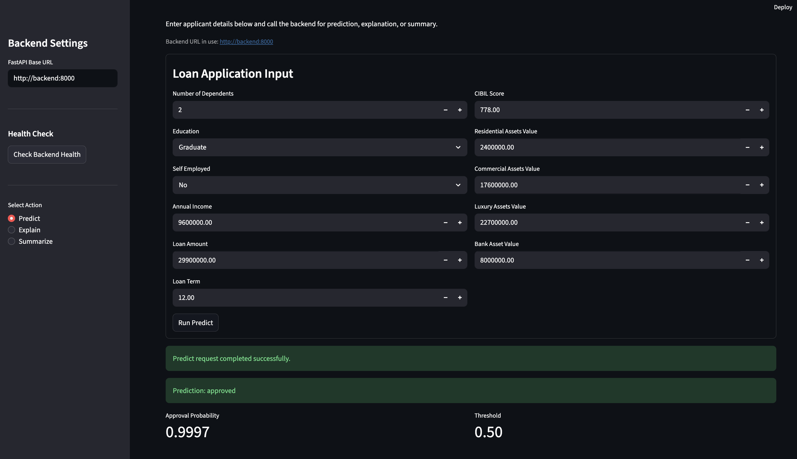
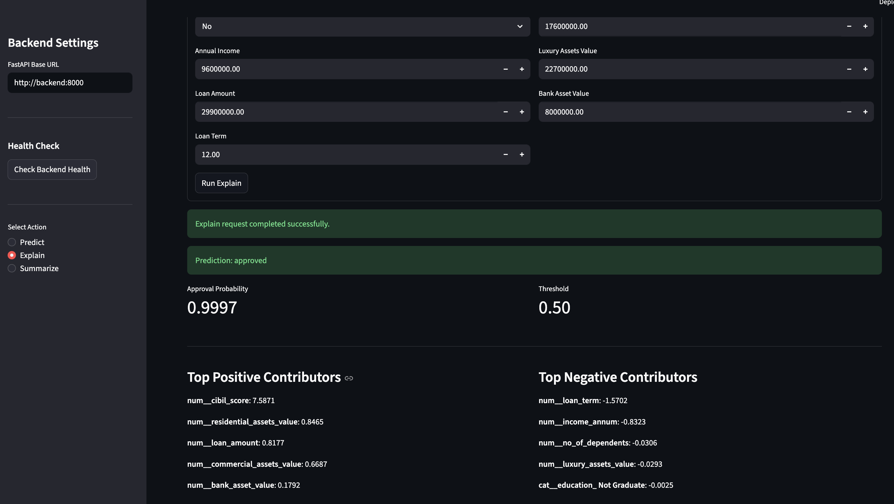
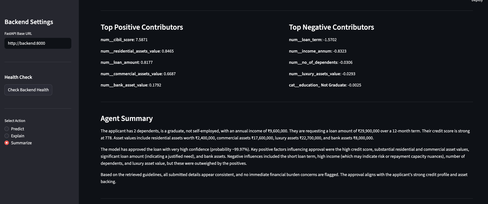
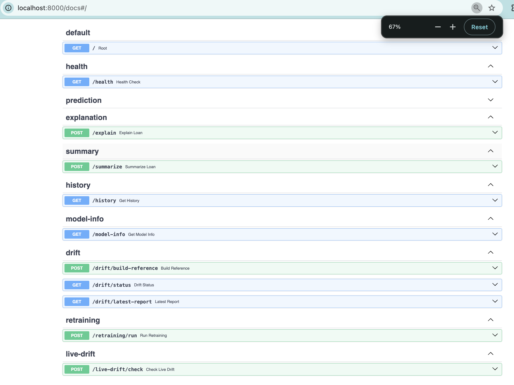
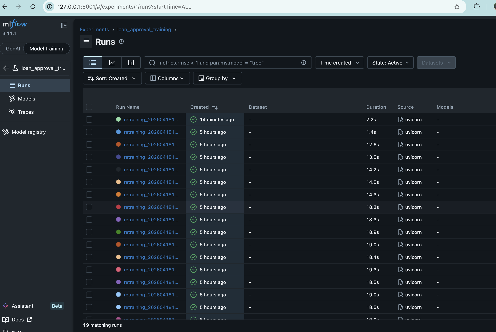
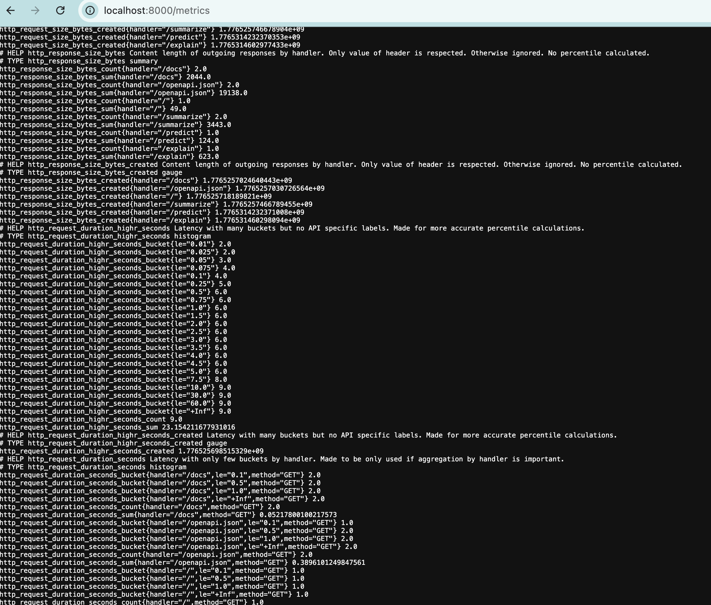
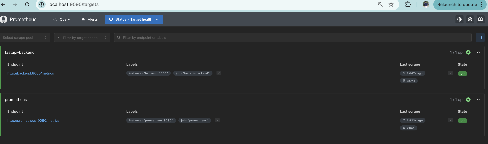
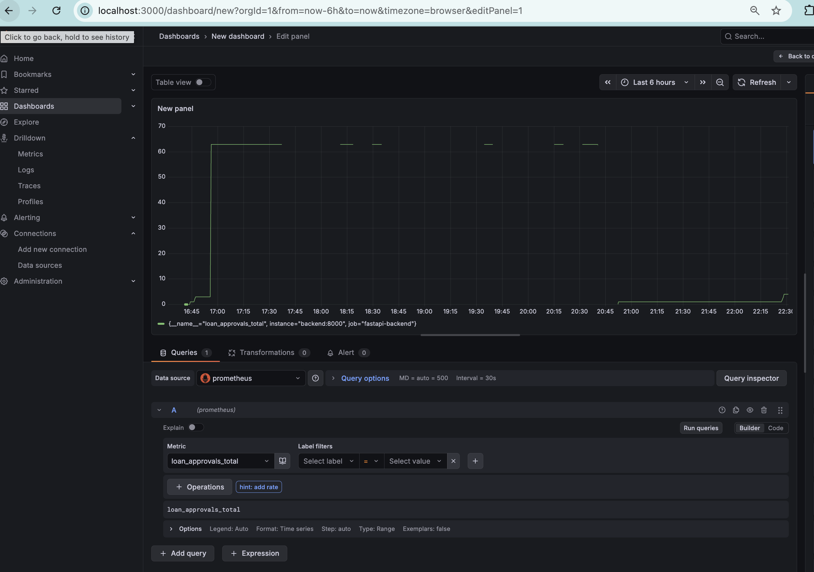
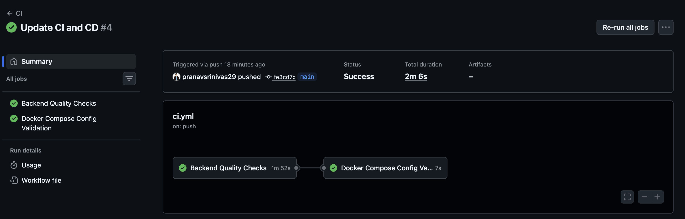
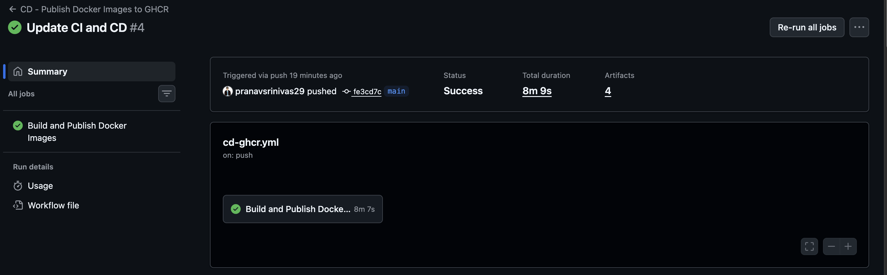

# LoanDecision-Engine

An end-to-end **Machine Learning + Agentic AI** system for **loan approval prediction, explanation, live drift monitoring, and automatic retraining**.

This project combines a production-style ML application stack with operational MLOps capabilities:
- **FastAPI** backend for prediction APIs
- **Streamlit** frontend for interactive use
- **SQLite** for inference history persistence
- **MLflow** for experiment tracking
- **Prometheus + Grafana** for observability
- **Drift detection** on live inference history
- **Auto-retraining + model auto-selection**
- **Docker Compose** for full local deployment
- **GitHub Actions CI/CD**
- **GHCR image publishing**
- **AI Agent summary layer** for analyst-style decision support

---

## Overview

The system predicts whether a loan application is likely to be approved, explains the decision, summarizes it for analysts through an **AI Agent layer**, stores inference history, monitors live drift, and can automatically retrain and promote the best model when drift is detected.

This project is designed as a **portfolio-grade adaptive ML system** that combines:
- **traditional machine learning** for decisioning
- **AI Agent capabilities** for explanation-oriented summarization
- **MLOps components** for monitoring, drift handling, and retraining

---

## Key Features

### Prediction and inference
- Single-loan approval prediction
- Probability output
- Threshold-based decisioning
- Active model metadata tracking

### Explainability
- Local explanation for predictions
- Positive and negative contributor summary
- Unified explanation flow across supported models

### Agentic summary
- Analyst-style summary generation
- Combines model prediction, local explanation, and retrieval/LLM layer

### Monitoring and observability
- FastAPI `/metrics` endpoint
- Prometheus scraping
- Grafana dashboards
- Request counts, latency, exception metrics
- Model-level counters and prediction probability distribution

### Drift-aware adaptive ML
- Reference stats built from training data
- Live drift detection on recent inference history
- Drift reports saved as artifacts
- Automatic retraining trigger when drift exceeds thresholds
- Multi-model comparison and best-model promotion

### MLOps
- MLflow tracking for retraining runs
- Dockerized services
- GitHub Actions CI
- GHCR-based CD for Docker image publishing

### AI Agent layer
- Agent-style summary generation for loan applications
- Combines model prediction, local explanation, and retrieved context
- Produces analyst-friendly narrative output instead of only raw scores
- Bridges traditional ML outputs with LLM-powered reasoning support

---

## Architecture

### Core components
- **Frontend:** Streamlit
- **Backend:** FastAPI
- **Database:** SQLite
- **Experiment Tracking:** MLflow
- **Monitoring:** Prometheus + Grafana
- **Containerization:** Docker + Docker Compose
- **Automation:** GitHub Actions
- **Modeling:** Logistic Regression, Random Forest, XGBoost
- **AI Agent Layer:** summary and reasoning support using retrieval + LLM orchestration

### Adaptive flow
1. User submits a loan application
2. Backend performs prediction using the active ML model
3. Local explanation is generated for the prediction
4. The AI Agent produces an analyst-style summary
5. Prediction result is stored in history
6. Recent inference history is checked for drift
7. If drift is strong enough:
   - retraining is triggered
   - candidate models are retrained
   - the best model is selected
   - active model artifacts and metadata are updated

### AI Agent role in the system

The AI Agent is not responsible for core model training or classification.  
Instead, it operates **on top of the traditional ML layer** to:

1. interpret model outputs
2. combine them with local feature contributions
3. use retrieved contextual knowledge where needed
4. generate an analyst-style summary for decision support

This makes the system a hybrid of:
- **Traditional ML** for prediction
- **AI Agent reasoning** for explanation and summarization
---

## Project Structure

```text
.
├── .github/
│   └── workflows/
│       ├── ci.yml
│       └── cd-ghcr.yml
├── artifacts/
│   ├── drift/
│   ├── retraining/
│   ├── active_model_metadata.json
│   ├── model_comparison.csv
│   └── preprocessor.joblib
├── data/
│   ├── raw/
│   └── processed/
├── grafana/
├── knowledge_base/
├── logs/
├── mlflow/
├── mlruns/
├── models/
│   └── best_model.joblib
├── monitoring/
│   └── prometheus.yml
├── requirements/
│   ├── api.txt
│   ├── frontend.txt
│   └── mlflow.txt
├── src/
│   ├── agent/
│   ├── api/
│   │   └── routes/
│   ├── config/
│   ├── db/
│   ├── drift/
│   ├── explainability/
│   ├── inference/
│   ├── monitoring/
│   ├── retraining/
│   ├── training/
│   └── docker/
│       ├── Dockerfile.api
│       ├── Dockerfile.frontend
│       ├── Dockerfile.mlflow
│       └── Dockerfile.prefect
├── docker-compose.yml
└── README.md
```

## What This Project Demonstrates

This project demonstrates:
- production-style ML API design
- integration of **Traditional ML + AI Agent workflows**
- explainability integration
- monitoring and operational visibility
- drift-aware model maintenance
- automatic retraining orchestration
- model comparison and promotion
- Dockerized deployment
- CI/CD readiness


### Screenshots
#### Streamlit UI for prediction, explanation and AI summary





#### FASTAPI backend


#### Mlflow UI


#### Logs


#### Prometheus and Grafana for monitoring



#### CI/CD pipeline


